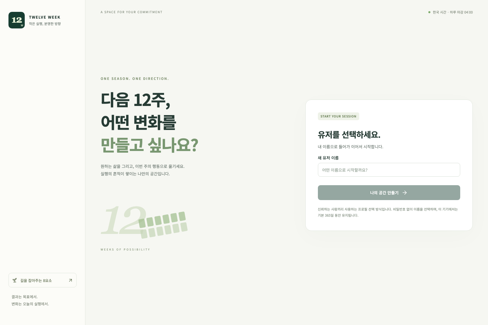

# 구현 상태 · 2026-10-06

첫 사용자용 웹 흐름을 로컬에서 구현·검증했다. GitHub 원격은 [joonyy/TwelveWeek](https://github.com/joonyy/TwelveWeek)이며 기본 브랜치는 `main`이다. Aiven/Render 자원 생성과 배포는 아직 하지 않았다.

## 사용할 수 있는 흐름

- 이름 생성/선택, 긴 세션 유지와 유저 전환.
- 비전, 목표별 12주 계획·장애물/대응·지표, 모범 주간, 공통 삶의 태도 1~11 영역 저장.
- 8요소 전체 도움말과 작성/실행/평가 순간별 안내.
- 12주 착수, 주간 전술 기준 보존, 미래 주의 계획 조정.
- 같은 주 일정 배치/변경, 매일 전술 날짜 유지, 04:00 경계의 일간 체크와 지난 실행 시각 정정.
- 일간 점수, 전술별 동일 비중의 주간 점수, 선행/후행지표와 선택형 주간 평가 저장.
- 모범 주간을 함께 보는 주간 일정, Apple Calendar용 .ics 다운로드.
- 13주차 12주 점수 추이, 선택형 회고, 주기 마무리와 기록 보관.
- 데스크톱/모바일 화면, 저장 전 이탈 안내, 요청 실패/충돌 표시, 변경 감사 기록.
- 실행 기간 1~12주 선택. 11주 목표·전술 주차·종료일·회고 주간 표시, 해당 기간만 집계. 기존 주기는 기본 12주로 보존하며 DB migration `003_cycle_length`를 자동 적용한다.
- 초안의 기간 변경, 착수 후 미래 주만 축소. 제외되는 미래 주 DB 기록·변경 이력을 보존하며 이번 주와 지난주의 실행 기준·점수는 유지한다.

## 입력 화면 개선 · 사용자 후속 요청 반영

- 장기 비전과 3년 비전: 목록/자유 서술 선택, 목록 기본, 항목 추가·삭제·Enter 입력. 내용·입력 방식 저장 및 복원.
- 새 계획: 목표 3개와 목표별 전술·장애물 칸을 준비. 빈 기본 목표는 착수·주간 분모에서 제외하며 일부 작성한 목표의 필수 항목은 검사.
- 모범 주간: 실제 주간 캘린더 UI, 빈 시간대 클릭 또는 위아래 드래그 생성. 드래그 중 30분 단위 시간 범위 미리보기, 놓으면 해당 길이로 입력창 열기, Esc 취소와 화면 끝 자동 스크롤. 시간 블록 수정·삭제·30분 단위 드래그 이동. 04:00를 넘기는 블록과 겹친 블록 표시. 실제 일정도 같은 캘린더로 표현.
- 책임: IMG_0076의 네 가지 태도 및 개인 생활·일에서 실천할 목록. 기존 책임 메모 유지.
- 헌신: IMG_0077의 7영역 바퀴, 영역별 목표 선언·핵심 활동·헌신 비용과 선택한 활동의 동그라미. 사용자 지정 기존 영역 유지.
- 단위·DB·브라우저에서 기존 자료 보존, 세 가지 빈 목표 제외, 목록 전환, 캘린더 드래그, 헌신 선택·새로고침 복원을 확인. 모바일 가로 넘침 없음.
- 브라우저 테스트는 별도 4111/5179 포트를 사용하여 실제 로컬 앱을 계속 열어둘 수 있음.

[비전 목록](screenshots/vision-lists.png) · [모범 주간](screenshots/model-calendar.png) · [책임](screenshots/responsibility.png) · [헌신 바퀴](screenshots/commitment-wheel.png)

## 검증 결과

| 검증 | 결과 |
|---|---|
| 도메인·입력 구조 단위 테스트 | 14/14 통과. 04:00 경계, 12+1주와 11+1주, 기간 축소의 내용 보존, 동일 비중 93.333…%, 일간 80%, N/A, 일정 유지, ICS UTC/이스케이프/UTF-8 접기 |
| 실제 PostgreSQL API 통합 | 14/14 통과. 사용자 소유 범위, 토큰 해시/만료/폐기, 동시 저장 충돌, 현재 주 기준 보존, 다음 주 조정, 일정 제약, 실제 실행 시각, 지표, 회고·마무리. 11주 생성·착수·회고 진입 시점, 기간 축소 시 기록 보존 |
| Chromium 전체 사용자 흐름 | 5개 통과. 유저 생성→1~11 작성→착수→일정→체크→평가→새로고침 복원→회고 저장. 캘린더 위·아래 드래그 생성, Esc 취소, 자동 스크롤, 다음 날 04:00 끝점, 키보드 입력, 길이 저장·복원. 11주 선택·저장·복원·착수·주차 탐색·12주차 회고. 모바일 390px 가로 넘침 없음 |
| 프로덕션 프론트 빌드 | 성공 |
| Docker Node 22.23.3 | 단위 테스트 12/12 및 프로덕션 프론트 빌드 성공. 로컬 기본 검증은 Node 24.7.0 |
| 배포/CI 설정 | Render, Compose, GitHub workflow YAML 파싱 성공. 실제 클라우드 적용은 미실행 |
| keepalive | 로컬 API health와 프론트 요청 성공. 원격 cron 활성화는 미실행 |
| 패키지 설치 감사 | 설치 시 취약점 0건 보고. package.json/lockfile 일치 확인 |
| 실제 사용 DB | 별도 `twelve_week`. 테스트 DB `twelve_week_test`와 분리. 실제 사용자 기록은 테스트 초기화 대상에서 제외하며 기존 초안 내용·시작일·기간을 임의로 변경하지 않음 |

브라우저 테스트의 날짜는 2026-10-07로 고정했다. 실제 API는 현재 서버 시각으로 동작한다. 테스트 성공은 10/5 실제 사용이나 Apple Calendar 앱의 가져오기 성공을 의미하지 않는다.

## 실행 및 배포 재개

- 로컬 웹: http://127.0.0.1:5178
- API: http://127.0.0.1:4110/api/health
- 서버가 종료됐다면 [README 실행 절차](../README.md#로컬-실행)를 따른다.
- Render 설정: [render.yaml](../render.yaml). Aiven 연결값·CA와 양쪽 origin 설정이 필요하다.
- GitHub `origin`: https://github.com/joonyy/TwelveWeek.git. 기존 초기 커밋과 LICENSE를 보존하며 `main`에서 구현을 관리한다. Push 시 GitHub Actions의 Checks가 실행된다.
- 구현 판단 검토: [PRODUCT.md](PRODUCT.md#구현자가-선택한-기본값--사용자-검토-대상).

## 남아 있는 실제 환경 확인

1. GitHub 저장소를 전용 Aiven/Render 자원과 연결, 실서비스 저장/복원 확인.
2. Apple Calendar 앱에서 .ics 가져오기 및 재가져오기 결과 확인. Google/Galaxy, 양방향 동기화는 후속 범위다.
3. 안내형 템플릿을 실제 목표로 채우고, 교대근무 한 주 동안 사용해 입력 부담과 일정 수정 방식 검토.
4. AI 맞춤 전술 제안, 시간 블록 가장자리 드래그로 길이 조절, 초과 실행 입력, 사용자 인증 강화는 첫 버전과 별도로 우선순위를 판단한다.

[실행 화면](screenshots/execution-desktop.png) · [모바일 실행 화면](screenshots/execution-mobile.png)

